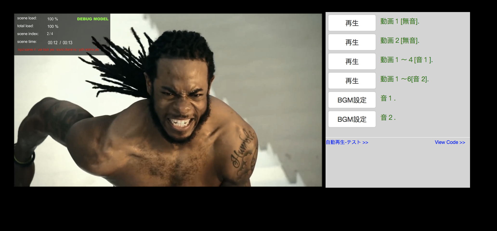
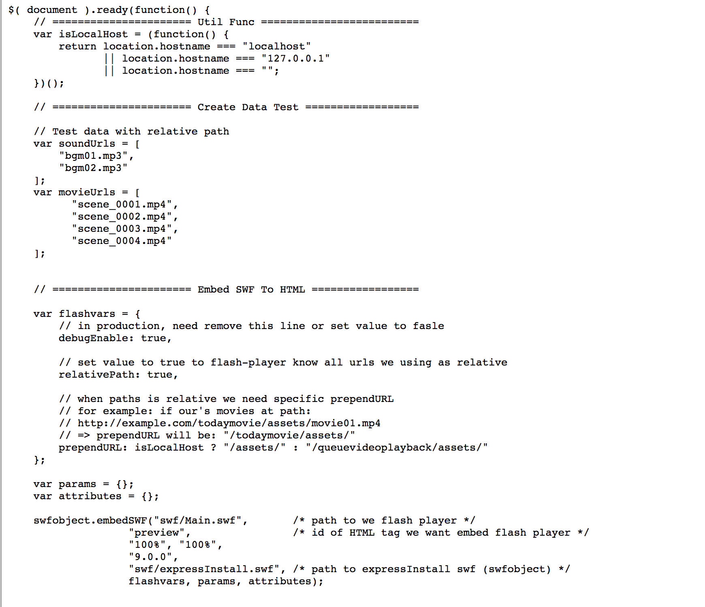
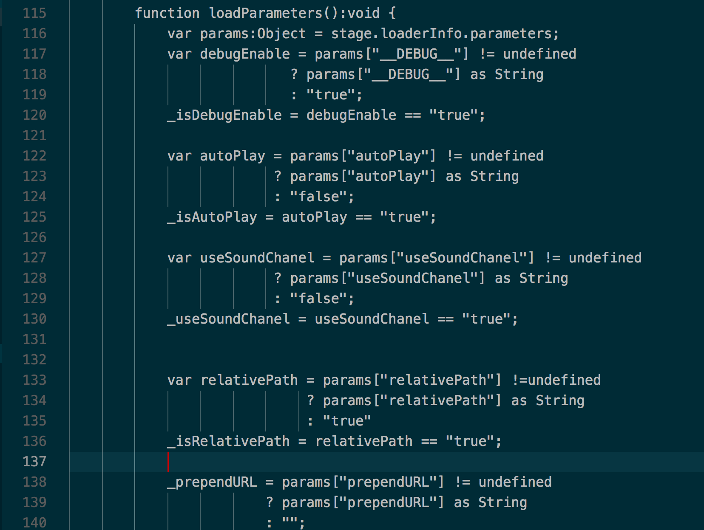
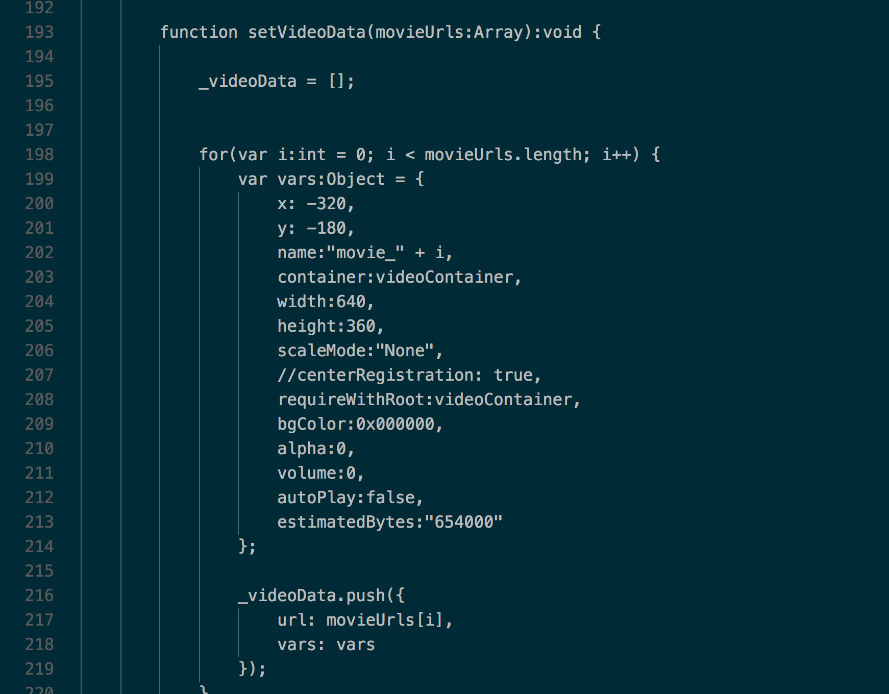
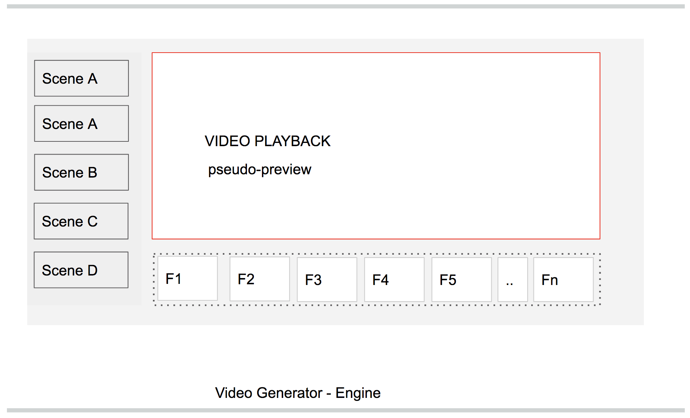
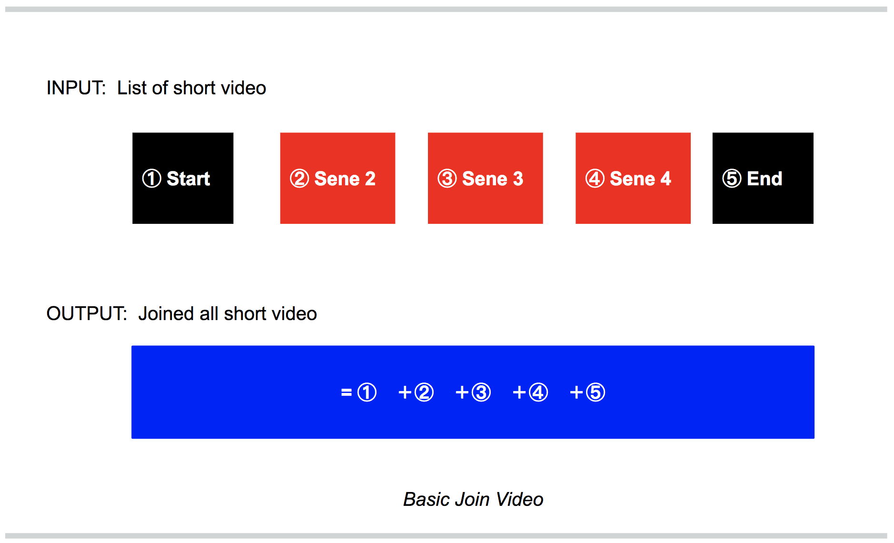
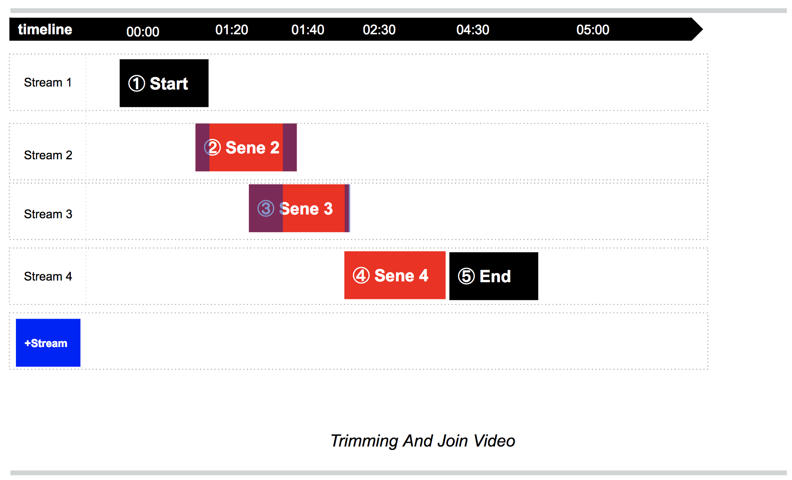
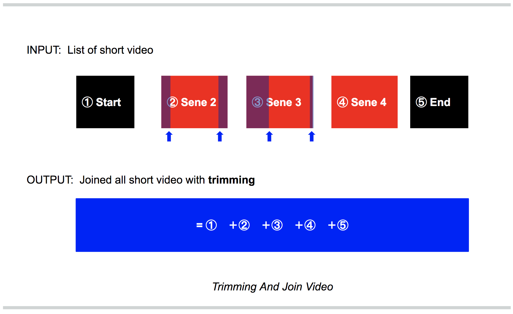

[DEMO PAGE](https://dungntnew.github.io/queuevideoplayback/index.html)

### Description

That video player engine is developed with ActionScript 3.0 and some libraries.
(special thank for loadermax of greensock).

There a some main features of that video player is:

1. play multi small parts of one or separted videos with Smooth Scene Transition.
2. allow play BGM sound with seperated channel
3. allow enqueue list of video urls and smart pre-buffer video & sound data.
4. support all play-pause, mute-sound etc in UI.
5. monitor loading info, current scene index etc.. with debug screen.
6. friendly javascript API is exported for programming in your production.  


### Guide to play sample pre-compiled video player in your PC

```
$ git clone repo-url
$ git checkout master && git pull

# install simple http server
$ npm install -g http-server 

# start simple http server with document root -> current folder
# now you can see demo under url: http://127.0.0.1:8000
$ http-server . 

```

### Guide to include video player in your product

```
<!-- step 1: include swfobject lib in html -->
<script type="text/javascript" src="swfobject.js"></script>

<!-- step 2: setup flash vars, that var will passed into video player -->
<!-- (ref API params & flash vars document for more info) -->
<script>
    var flashvars = {
        __DEBUG__: false,            /* disable debug model */
        allowScriptAccess: 'always', /* 念のため　*/
        debugEnable: true,          /* in production, need remove this line or set value to fasle */
        relativePath: false,        /* set value to false to flash-player know all urls we using as absolute */
        
        /* when we want to auto play, we need some params init flash player */
        autoPlay: true,                            /* when we want to play immediate */
        useSoundChanel: true,                      /* when we want to play immediate 
                                                      Notice(*): to avoid conflig with other sound (BGM)
                                                      please set soundURL to empty other do not setting.
                                                   */
                                                   
        soundUrl: "",                              /* 
                                                        setup initial start-up sound url [ use for autoPlay ] 
                                                        Notice(*): this options will override useSoundChanel setting! 
                                                    */
        movieUrls:  JSON.stringify(fullMovieUrls)   /* setup initial start-up movie urls - must is json [ use for autoPlay ] */ 
    };
    
    
    var params = {};
    var attributes = {};
    </script>

    <!-- step 3: embed pre-compiled Video Player -->
    <script>
    swfobject.embedSWF("swf/Main.swf",           /* path to we video player */
                       "preview",                /* id of HTML tag we want embed video player */ 
                       "100%", "100%", 
                       "9.0.0", 
                       "swf/expressInstall.swf", /* path to expressInstall swf (swfobject) */
                       flashvars, params, attributes);
    </script>


    <!-- step 4: write some function to call exported method of video-editor -->
    <script>
        $("#play-one-movie-btn-2").click(function(){ 
            var player = document.getElementById("preview");
            player.playMovie(movieUrls[1], ""); 
        });
        
        $("#play-multi-movie-btn").click(function(){
            var player = document.getElementById("preview");
            player.playMultiMovies(movieUrls, soundUrls[0]);    
        });
        
        $("#change-bgm-btn-1").click(function(){ 
            var player = document.getElementById("preview");
            player.setBGM(soundUrls[0]);    
        });
    </script>
```

### API & params

#### flash vars

| var | desc |
|:---|---:|
| debugEnable | use for show debug UI, in production, need remove this line or set value to fasle 
| autoPlay | when we want to play immediate 
| soundUrl | init bgm sound url, used when autoPlay = true
| movieUrls | init queue movie urls, used when autoPlay = true
| relativePath | set value to true to player know all urls we using as relative
| prependURL | auto add prefix url, for example if full url is: http://example.com/todaymovie/assets/movie01.mp4 => prependURL will be: "/todaymovie/assets/" 


#### exported method

| method | desc |
|:---|---:|
| playMovie(movieUrl, soundUrl) | play a movie by url
| playMultiMovies(movieUrls, soundUrl) | play queued movies with input is array of url and sound url
| setBGM (bgm url) | change background sound url 


### Feferences - Sample Code






### Feferences - Video Editor Engine Components







